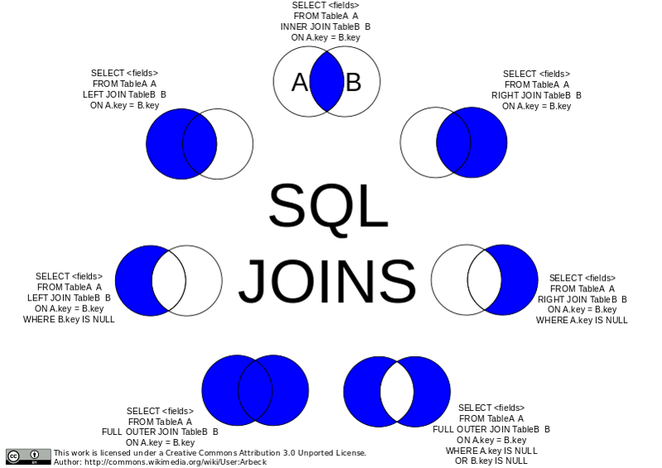

# Join Statements

## Introduction

In this lesson, we'll introduce join statements and the problems they're designed to solve.

## Objectives  

You will be able to:  
* Understand why joins are important 
* Compare and contrast the various types of joins
* Explain the syntax and structure of join statements
* Explain the role of foreign and primary keys in them

## The Importance of Joins in SQL

The SQL join clause is used to combine records from two or more tables in a database. Why might that be useful/important? Well imagine a customer database. In the simplest possible implementation it might just have a single `customers` table with fields for `first_name`, `last_name` and `email`. 

Over time, though you might want to store more information about your customers. Perhaps you need to mail them something. In that case, you'll want to store a mailing address in the database. Perhaps we could add `address_1`, `address_2`, `city`, `state` and `zip` fields *(assuming all of our customers are US based)*.

That works, but what happens when a user changes their mailing address? We could just update the values contained in the fields, but now we're losing data. For example, if I was to ask "where did we mail their order 4 months ago" we wouldn't know by looking at the database because it's possible that we updated the mailing address fields some time in the last four months. And what if we need a billing address for them? Or to provide them with an address book so they can decide whether they want things mailed to their home, work or the hotel they're traveling to?

The obvious answer to all of this is that instead of adding the address to the `customers` table, we'd probably be better creating a whole new `addresses` table. But the question then becomes ***"how do we know which customer a given address belongs to?*** And that is where joins come in.

Joins are the primary mechanism for combining data from multiple tables. In order to do this, you define the common attribute(s) between tables in order for them to be combined.


## CRM Schema

Here's a diagram of a customer relationship management database that we're going to be using in this lesson.


## Connecting to the Database

As usual, you'll start by connecting to the database.


```python
import sqlite3
import pandas as pd
```


```python
conn = sqlite3.connect('data.sqlite', detect_types=sqlite3.PARSE_COLNAMES)
cur = conn.cursor()
```

## Displaying product details along with order details
Let's say you need to generate some report that includes details about products from orders. To do that, we would need to take data from multiple tables in a single statement.


```python
cur.execute("""SELECT * FROM orderdetails
                        JOIN products
                        ON orderdetails.productCode = products.productCode
                        LIMIT 10;
                       """)
df = pd.DataFrame(cur.fetchall()) #Take results and create dataframe
df.columns = [i[0] for i in cur.description]
df.head()
```

## Compared to the individual tables:

### orderdetails


```python
cur.execute("""SELECT * FROM orderdetails LIMIT 10;""")
df = pd.DataFrame(cur.fetchall()) #Take results and create dataframe
df.columns = [i[0] for i in cur.description]
df.head()
```

### products


```python
cur.execute("""SELECT * FROM products LIMIT 10;""")
df = pd.DataFrame(cur.fetchall()) #Take results and create dataframe
df.columns = [i[0] for i in cur.description]
df.head()
```

## the using clause
A more concise way to join the tables if the column name is identical is the using clause. Rather then saying on `tableA.column = tableB.column` we can simply say `using(column)`. Again, this only works if the column is identically named for both tables.


```python
cur.execute("""SELECT * FROM orderdetails
                        JOIN products
                        USING(productCode)
                        LIMIT 10;
                       """)
df = pd.DataFrame(cur.fetchall()) #Take results and create dataframe
df.columns = [i[0] for i in cur.description]
df.head()
```

## Aliasing
You can also alias tables by giving them an alternative shorthand name directly after them. Here we use the aliases 'o' and 'p' for orderdetails and products respectively. This can save typing if you have to reference the tables multiple times in your queries.


```python
cur.execute("""SELECT * FROM orderdetails o
                        JOIN products p
                        ON o.productCode = p.productCode
                        LIMIT 10;
                       """)
df = pd.DataFrame(cur.fetchall()) #Take results and create dataframe
df.columns = [i[0] for i in cur.description]
df.head()
```

## Left Joins

By default, a join is an inner join, or the intersection between two tables. In other words, the join between orders and products is only for productCodes that are in both the orderdetails and products tables. If a product had yet to be ordered (and wasn't in the orderdetails table) then it would not be in the result of the join. And if for some reason there was an order detail that referred to an old product that no longer lived in the products table, that record would also not show up.

There are many other types of joins, displayed below. Of these, sqlite does not support outer joins, but it is good to be aware of as more powerful versions of sql such as PostgreSQL support these additional functions.



For example, the statement  
  
`SELECT * FROM products LEFT JOIN orderdetails; `  

would return all products, even those that hadn't been ordered. 
You can imagine that all products in inventory should have a description in the product table, but perhaps not every product is represented in the orderdetails table as some may not have been purchased by anyone yet.


```python
cur.execute("""SELECT * FROM products
                        LEFT JOIN orderdetails
                        USING(productCode);
                       """)
df = pd.DataFrame(cur.fetchall()) #Take results and create dataframe
df.columns = [i[0] for i in cur.description]
print(len(df))
print(len(df[df.orderNumber.isnull()]))
df[df.orderNumber.isnull()].head()
```

As you can see, there is one product that hasn't been ordered yet.

## Primary Versus Foreign Keys

Another important consideration when performing joins is to think more about the key or column you are joining on. As  this can lead to problematic behavior if the join value is not unique in one or both of the tables. In all of the above examples, you joined two tables using the **primary key**. The primary key(s) of a table are those column(s) which uniquely identify a row. You'll also see this designated in our schema diagram with the asterisk (*).


You can also join tables using **foreign keys** which are not the primary key for that particular table, but rather another table. For example, employeeNumber is the primary key for the employees table and corresponds to the salesRepEmployeeNumber of the customers table. In the customers table, salesRepEmployeeNumber is only a foreign key, and is unlikely to be a unique identifier, as it is likely that an employee serves multiple customers. As such, in the resulting view, employeeNumber would no longer be a unique field.


```python
cur.execute("""SELECT * FROM customers c
                        JOIN employees e
                        ON c.salesRepEmployeeNumber = e.employeeNumber
                        ORDER BY employeeNumber;
                       """)
df = pd.DataFrame(cur.fetchall()) #Take results and create dataframe
df.columns = [i[0] for i in cur.description]
df.head()
```

Notice that this also returned both columns: salesRepEmployeeNumber and employeeNumber.

## Summary

In this lesson you investigated joins including the `ON` and `USING` SQL key words, aliasing table names, left joins and primary and foreign keys.
